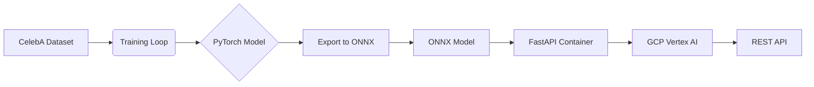

# Face Generation Pipeline

<div align="center">

[](LICENSE)
[](https://www.python.org/)
[](https://pytorch.org/)
[](https://fastapi.tiangolo.com/)
[](https://onnxruntime.ai/)

<p align="center">
  <strong style="font-size: 24px;">An End-to-End StyleGAN3 Production Pipeline</strong>
</p>

</div>

---

## 📖 Introduction

**Face Generation Pipeline** is a production-ready Machine Learning system designed for high-fidelity face synthesis. It bridges the gap between state-of-the-art research (StyleGAN3) and scalable cloud deployment (GCP Vertex AI).

Unlike standard research repositories, this project emphasizes **MLOps best practices**, **modularity**, and **security**.

### Key Features

-   **🎨 Advanced Generation**: Fine-tuned StyleGAN3 architecture for alias-free, high-quality face synthesis.
-   **🚀 Optimized Inference**: Automated PyTorch-to-ONNX conversion for low-latency serving.
-   **☁️ Cloud Native**: Dockerized deployment with auto-scaling support on **Google Cloud Vertex AI**.
-   **🛡️ Ethical Safeguards**: Built-in **invisible watermarking** for provenance tracking and deepfake mitigation.
-   **🧩 Modular Design**: Configuration-driven registry system inspired by MMDetection.

---

## 🛠️ Installation

### Prerequisites

-   Linux or macOS
-   Python 3.10+
-   CUDA 11.8+ (for training)

### Setup

1.  **Clone the repository**
    ```bash
    git clone https://github.com/yourusername/face-gen-pipeline.git
    cd face_gen
    ```

2.  **Create Conda environment**
    ```bash
    conda env create -f environment.yml
    conda activate face-gen-pipeline
    ```

---

## ⚡ Quick Start

### 1. Training (Local)

Fine-tune the StyleGAN3 model on the CelebA dataset.

```bash
# Start training with default config
bash scripts/step1_train.sh
```

### 2. Validation

Evaluate the trained model and compute metrics (e.g., FID, KID).

```bash
# Run model evaluation
bash scripts/step2_validation.sh
```

### 3. Inference

Generate new images using the trained PyTorch model (not the API).

```bash
# Generate images from specified seeds
bash scripts/step3_inference.sh
```

### 4. Export Model

Convert the trained PyTorch checkpoint (`.pth`) to an optimized ONNX model (`.onnx`).

```bash
# Export latest checkpoint
bash scripts/step4_export.sh
```

### 5. Local Serving

Launch the high-performance FastAPI inference server locally.

```bash
# Start server on port 8080
bash scripts/step5_serve_local.sh
```

**Test the API:**
```bash
curl -X POST http://localhost:8080/generate \
     -H "Content-Type: application/json" \
     -d '{"seed": 42, "truncation_psi": 0.7}'
```

### 6. Deployment

Deploy the entire pipeline to **GCP Vertex AI** with a single command.

```bash
# Requires gcloud CLI and Docker
bash scripts/step6_deploy_gcp.sh
```

---

## 📘 Documentation

For detailed guides, please refer to the `docs/` directory:

-   [**Training Guide**](docs/pipeline/01_training.md): Data prep, config tuning, and training loop.
-   [**Model Export**](docs/pipeline/02_export.md): ONNX conversion details and dynamic axes.
-   [**Local Serving**](docs/pipeline/03_serving_local.md): API endpoints, authentication, and testing.
-   [**Cloud Deployment**](docs/pipeline/04_deployment.md): Vertex AI setup, containerization, and auto-scaling.
-   [**Data & Architecture**](docs/pipeline/05_data_celeba.md): CelebA dataset specs and StyleGAN3 architecture.

---

## 🏗️ Architecture

### Code Structure

The codebase follows a modular design pattern:

```text
face_gen/
├── configs/             # ⚙️ Configuration files (Python-based)
├── data/                # 💾 Dataset storage
├── docker/              # 🐳 Dockerfiles for inference
├── docs/                # 📚 Documentation
├── src/                 # 🧠 Source Code
│   ├── apis/            # FastAPI & Inference Logic
│   ├── core/            # Registry, Hooks, Config
│   ├── datasets/        # Data Loading Pipelines
│   ├── models/          # StyleGAN3 Architecture
│   └── tools/           # CLI Scripts (Train, Export, Deploy)
├── tests/               # ✅ Unit & Integration Tests
└── work_dirs/           # 📂 Artifacts (Checkpoints, Logs)
```

### Pipeline Overview



---

## 🤝 Contributing

We welcome contributions! Please see [CONTRIBUTING.md](CONTRIBUTING.md) for details on how to submit pull requests, report issues, and request features.

## 📜 License

This project is licensed under the [MIT License](LICENSE).

## 🙏 Acknowledgements

-   [StyleGAN3](https://github.com/NVlabs/stylegan3) by NVlabs.
-   [MMDetection](https://github.com/open-mmlab/mmdetection) for the registry design pattern.